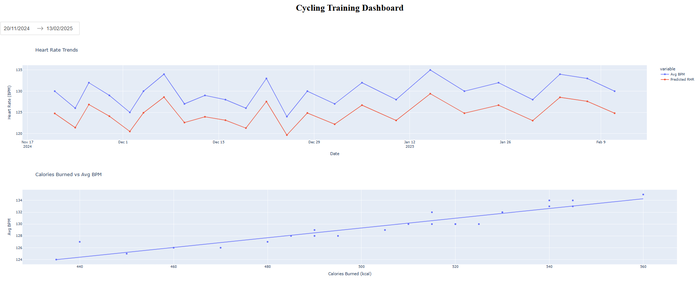
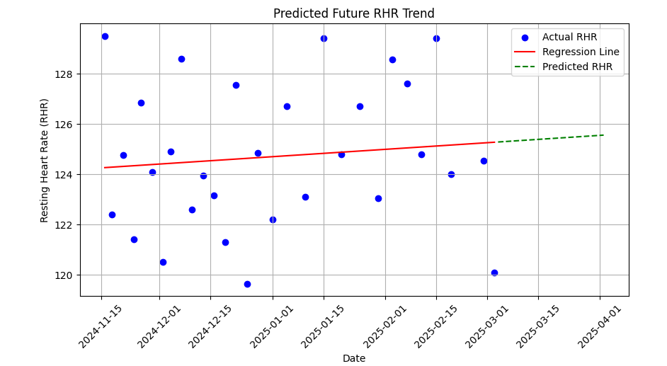

# RHR Performance Analysis & Prediction (Cycling)

## Objectives  
- Analyze trends in **Resting Heart Rate (RHR)**, **power output**, **cadence**, and **speed** over time.  
- Identify correlations between **heart rate, power efficiency, and speed** using data visualizations.  
- Predict future **RHR trends** using **Linear Regression** to assess training effectiveness.  
- Provide insights into cardiovascular performance and training adaptation for optimization.  

---



---

## Features  

### Data Visualization  

- **Resting Heart Rate (RHR) Trends** over time.  
- **Heart Rate vs. Power Output** analysis.  
- **Cadence vs. Speed Relationship** visualization.  
- **Peak Power Output Trends** tracking.  


### Predictive Analysis  
- Implements **Linear Regression** to predict future **Avg BPM (Resting Heart Rate)**.  
- Assesses whether the **RHR trend is improving or declining**.  

---



---

### Installation & Usage
## Clone the Repository
```bash
git clone https://github.com/Jung028/RHR_Analysis.git
pip install dash pandas plotly
jupyter lab RHR_Analysis.ipynb
```

# Run the Analysis 
```bash
python cycling_dashboard.py
```

## License 
This project is licensed under the MIT License.

## Future : 
1. Create Dashboard 
2. Create connection auto update. 
3. Predict more useful : predict overtrainng, tell if next training should be hard/easy, 
4. Analysis for running and swimming as well


